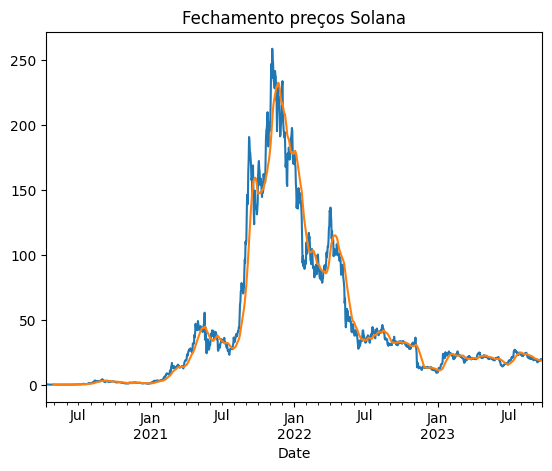
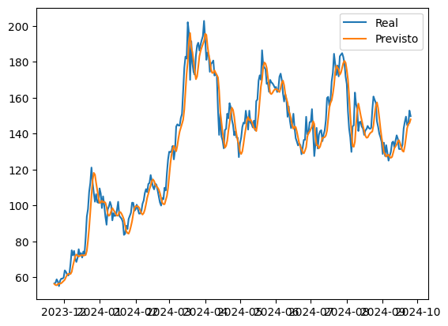
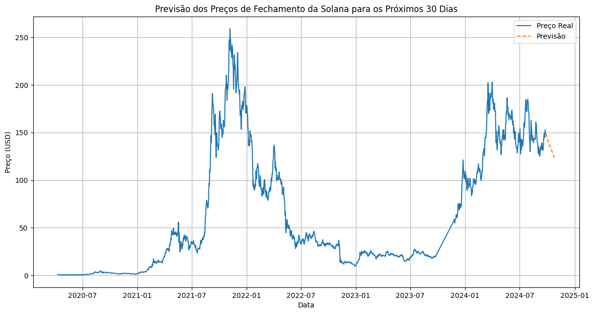

# CryptoPredict

# Descrição do Projeto

Esse projeto fei feito para uma atividade ponderada, do curso de engenharia da computação na Inteli, no ano de 2024. O projeto consiste em prever o preço de uma criptomoeda, utilizando séries temporais.

# Análise Exploratória 

## Análise 1

Primeiro, vamos discutir o que eu fiz de exploração de dados no arquivo presente em `src/Modelo/analise.ipynb`, que foi a análise inicial.

Primeiro, eu decidi que iria fazer uma análise da moeda Solana (SOL-USD), por ser uma criptomoeda que eu acredito que tem um potencial de crescimento grande e não apresenta tantas peculiaridades quanto outras moedas.

Para obter os dados eu utilizei a biblioteca `yfinance`, com uma range de data de 2017-05-01 até 2023-09-24.

Eu fiz alguns gráficos para entender a distribuição dos dados e algumas outras análises, como a média móvel e a decomposição da série temporal.



Depois disso parti para o pré-processamento dos dados, que consistiu em normalizar os dados e separar em treino e teste. Para fazer a normalização, eu utilizei a função MixMaxScaler da biblioteca `sklearn` para normalizar os dados entre 0 e 1.

As features que eu utilizei para treinar o modelo foram o preço de fechamento da moeda, que é o que eu quero prever.

### Criando o modelo

Para criar o modelo, eu utilizei uma rede neural recorrente, mais especificamente uma LSTM. Eu decidi utilizar essa rede, pois ela é muito boa para prever séries temporais, por conta de sua capacidade de "memorizar" padrões em dados sequenciais.

Para o meu input, eu utilizei 60 dias de dados para prever o próximo dia. Nesse teste eu criei o modelo dessa maneira:

```python
model = Sequential()
model.add(LSTM(units=50, return_sequences=True, input_shape=(x_train.shape[1], 1)))
model.add(LSTM(units=50))
model.add(Dense(units=1)) # Prever um valor de saída que no caso é o valor de close

model.compile(optimizer='adam', loss='mean_squared_error')
model.fit(x_train, y_train, epochs=25, batch_size=32)

```

### Resultados

Com o modelo treinado, eu fiz a previsão dos dados de teste e plotei o gráfico para comparar com os dados reais.



Como podemos ver, o modelo conseguiu prever bem o comportamento da moeda e obteve um MSE de 66.6 no conjunto de teste.

Apesar desse resultado, quando vamos prever o valor dos próximos, quando vamos prever o valor dos próximos dias ele não apresenta um resultado confiável e consistente.



Para facilitar testes eu criei uma classe chamada `CryptoPredicter` que encapsula o modelo e facilita a previsão de novos valores.