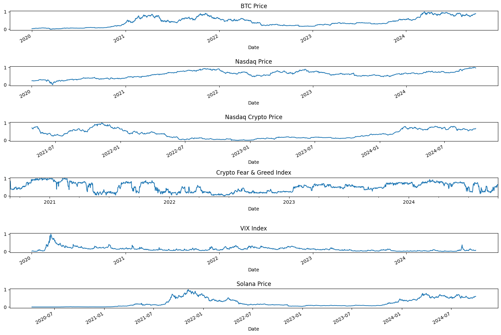
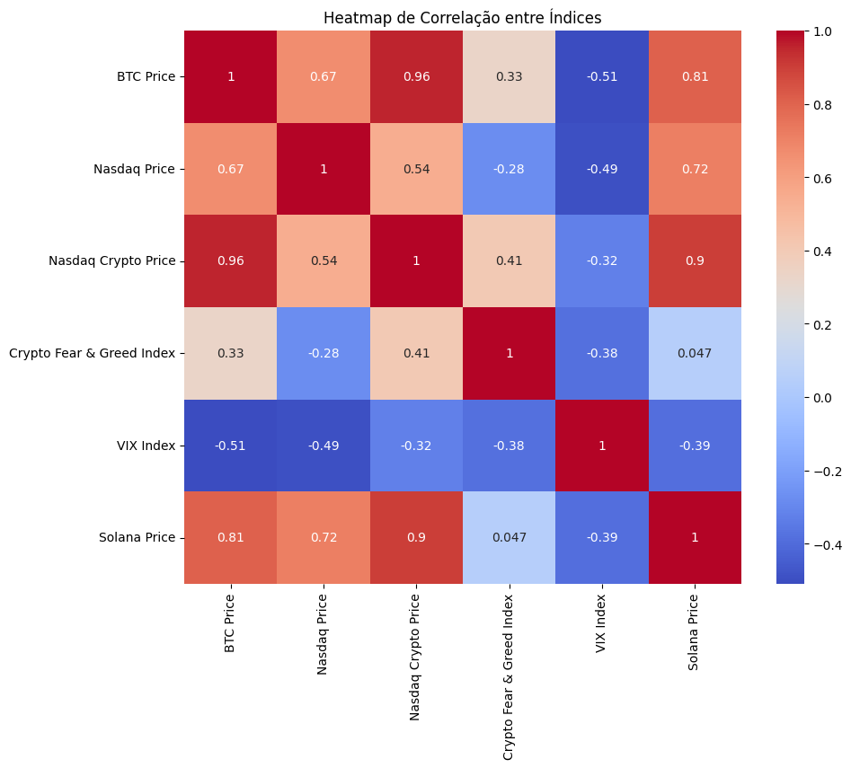
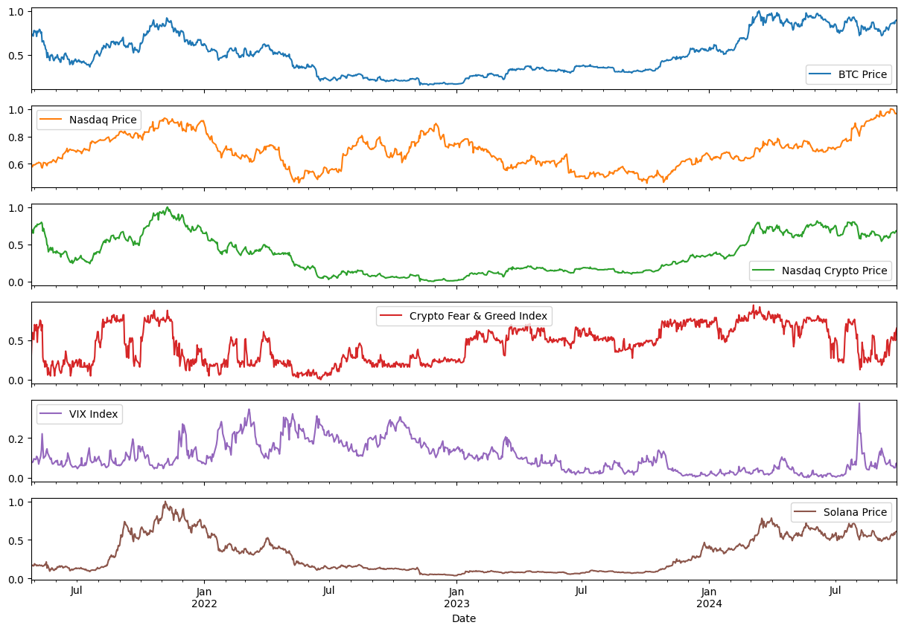
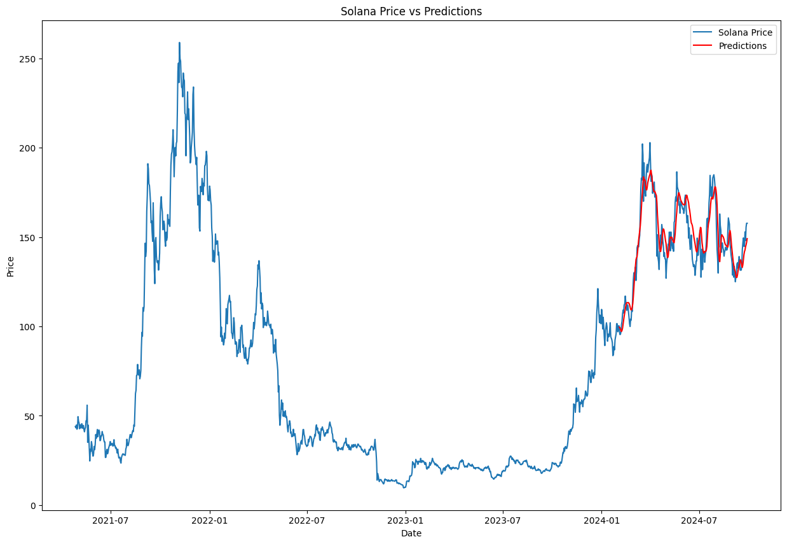
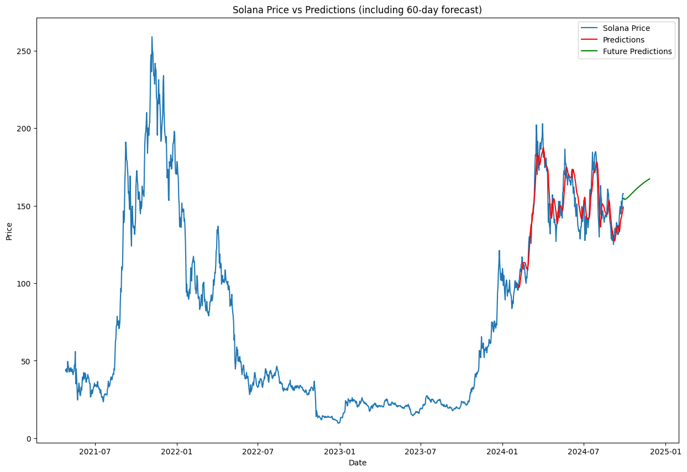

# CryptoPredict

# Descrição do Projeto

Esse projeto fei feito para uma atividade ponderada, do curso de engenharia da computação na Inteli, no ano de 2024. O projeto consiste em prever o preço de uma criptomoeda, utilizando séries temporais.

# Análise Exploratória 

## Análise 1

Primeiro, vamos discutir o que eu fiz de exploração de dados no arquivo presente em `src/Modelo/analise.ipynb`, que foi a análise inicial.

Primeiro, eu decidi que iria fazer uma análise da moeda Solana (SOL-USD), por ser uma criptomoeda que eu acredito que tem um potencial de crescimento grande e não apresenta tantas peculiaridades quanto outras moedas.

Para obter os dados eu utilizei a biblioteca `yfinance`, com uma range de data de 2017-05-01 até 2023-09-24.

Eu fiz alguns gráficos para entender a distribuição dos dados e algumas outras análises, como a média móvel e a decomposição da série temporal.


Depois disso parti para o pré-processamento dos dados, que consistiu em normalizar os dados e separar em treino e teste. Para fazer a normalização, eu utilizei a função MixMaxScaler da biblioteca `sklearn` para normalizar os dados entre 0 e 1.

As features que eu utilizei para treinar o modelo foram o preço de fechamento da moeda, que é o que eu quero prever.

### Criando o modelo

Para criar o modelo, eu utilizei uma rede neural recorrente, mais especificamente uma LSTM. Eu decidi utilizar essa rede, pois ela é muito boa para prever séries temporais, por conta de sua capacidade de "memorizar" padrões em dados sequenciais.

Para o meu input, eu utilizei 60 dias de dados para prever o próximo dia. Nesse teste eu criei o modelo dessa maneira:

```python
model = Sequential()
model.add(LSTM(units=50, return_sequences=True, input_shape=(x_train.shape[1], 1)))
model.add(LSTM(units=50))
model.add(Dense(units=1)) # Prever um valor de saída que no caso é o valor de close

model.compile(optimizer='adam', loss='mean_squared_error')
model.fit(x_train, y_train, epochs=25, batch_size=32)

```

### Resultados

Com o modelo treinado, eu fiz a previsão dos dados de teste e plotei o gráfico para comparar com os dados reais.


Como podemos ver, o modelo conseguiu prever bem o comportamento da moeda e obteve um MSE de 66.6 no conjunto de teste.

Apesar desse resultado, quando vamos prever o valor dos próximos, quando vamos prever o valor dos próximos dias ele não apresenta um resultado confiável e consistente.


Para facilitar testes eu criei uma classe chamada `CryptoPredicter` que encapsula o modelo e facilita a previsão de novos valores.

```python
class CryptoPredicter:
    def __init__(self, CryptoName, start_date, end_date, prediction_days=60):
        self.CryptoName = CryptoName
        self.start_date = start_date
        self.end_date = end_date
        self.prediction_days = prediction_days
        
    def get_data(self):
        data = yf.download(self.CryptoName, start=self.start_date, end=self.end_date)
        print(data)
        return data

    def train_model(self, data):
        close_data = data['Close'].values.reshape(-1, 1)
        scaler = MinMaxScaler()
        scaled_close_data = scaler.fit_transform(close_data)
        prediction_days = self.prediction_days
        x_train = []
        y_train = []
        for x in range(prediction_days, len(scaled_close_data)):
            x_train.append(scaled_close_data[x-prediction_days:x, 0])
            y_train.append(scaled_close_data[x, 0])
        x_train, y_train = np.array(x_train), np.array(y_train)
        x_train = np.reshape(x_train, (x_train.shape[0], x_train.shape[1], 1))
        model = Sequential()
        model.add(LSTM(units=50, return_sequences=True, input_shape=(x_train.shape[1], 1)))
        model.add(LSTM(units=50))
        model.add(Dense(units=1))
        model.compile(optimizer='adam', loss='mean_squared_error')
        model.fit(x_train, y_train, epochs=25, batch_size=32)
        model.save(f'{self.CryptoName}_model.h5')
        return model
    
    def predict(self, model, data, days_to_predict=30):
        close_data = data['Close'].values.reshape(-1, 1)
        scaler = MinMaxScaler()
        scaled_close_data = scaler.fit_transform(close_data)
        x_test = []
        for x in range(days_to_predict, len(scaled_close_data)):
            x_test.append(scaled_close_data[x-days_to_predict:x, 0])
        x_test = np.array(x_test)
        x_test = np.reshape(x_test, (x_test.shape[0], x_test.shape[1], 1))
        predicted_prices = model.predict(x_test)
        predicted_prices = scaler.inverse_transform(predicted_prices)
        return predicted_prices
    
    def forecast(self, model, data, days_to_predict=30):
        close_data = data['Close'].values.reshape(-1, 1)
        scaler = MinMaxScaler()
        scaled_close_data = scaler.fit_transform(close_data)
        last_prediction_days = scaled_close_data[-self.prediction_days:]
        predicted_prices = []
        x_input = last_prediction_days.reshape(1, self.prediction_days, 1)
        for _ in range(days_to_predict):
            prediction = model.predict(x_input, verbose=0)
            predicted_prices.append(prediction[0][0])
            prediction_reshaped = prediction.reshape(1, 1, 1)
            x_input = np.concatenate((x_input[:,1:,:], prediction_reshaped), axis=1)
        predicted_prices_array = np.array(predicted_prices).reshape(-1, 1)
        predicted_prices_actual = scaler.inverse_transform(predicted_prices_array)
        last_date = data.index[-1]
        future_dates = pd.date_range(start=last_date + pd.Timedelta(days=1), periods=days_to_predict, freq='D')
        forecast_df = pd.DataFrame({'Date': future_dates, 'Predicted_Close': predicted_prices_actual.flatten()})
        forecast_df.set_index('Date', inplace=True)
        return forecast_df
    
    def plot_forecast(self, forecast_df):
        plt.figure(figsize=(14,7))
        plt.plot(sol_data_all.index, sol_data_all['Close'], label='Preço Real')
        plt.plot(forecast_df.index, forecast_df['Predicted_Close'], label='Previsão', linestyle='--')
        plt.title(f'Previsão dos Preços de Fechamento da {self.CryptoName} para os Próximos 30 Dias')
        plt.xlabel('Data')
        plt.ylabel('Preço (USD)')
        plt.legend()
        plt.grid(True)
        plt.show()

```
## Análise 2

Para uma segunda análise, eu decidi tomar uma abordagem diferente e adicionar masi features para o modelo. Eu fiz porque estamos lidando com ações e a economia em si não segue um padrão tão liear, existe muitos outros fatores externos que podem influenciar o preço de uma ação. Então peguei alguns outros dados temporais externos para tentar melhorar a previsão.

As features que eu adicionei foram: preço do bitcoin, preço da NASDAQ e NASDAQ Crypto, Crypto Fear & Greed Index, VIX Index, e o preço da moeda em si, no caso SOLANA.

Para obter esses dados, grande parte deles eu utilizei a biblioteca `yfinance`, mas para o Crypto Fear & Greed Index eu utilizei a API do site `alternative.me`.

Como alguns dados começavam em datas diferentes, eu tive que fazer um tratamento para que todos os dados começassem na mesma data. Limitei inicialmente para o ano de 2020. Depois dissos, eu fiz o mesmo processo de normalização e separação dos dados de treino e teste.

Para uma analise incial, eu plotei cada uma das features para entender a distribuição dos dados.



Nesses gráficos podemos ver que o preço do bitcoin e da NASDAQ Crypto tem uma correlação muito forte com o preço do SOLANA, o que é esperado, já que são criptomoedas. O VIX Index e o Crypto Fear & Greed Index também tem uma correlação, mas não tão forte. É possivel ver que os valores tendem a subir juntos ou descer juntos. Para entender melhor essa correlação, eu fiz uma matriz de correlação.



É possivel ver que quase todas as featurs tem uma correlação positiva com o preço do SOLANA, o que é esperado. A feature que tem a maior correlação é o valor das NASDAQ Crypto, com 0.9. Existe uma correlação negativa com o VIX Index, o que também é esperado, já que o VIX é um índice de volatilidade. Mesmo tendo uma correlação negativa, eu decidi manter essa feature, pois acredito que ela pode ser útil para o modelo.

Seguindo com a preparação dos dados, eu filtrei para que todos os dados começassem na mesma data (2021-04-26), já que o valor da NASDAQ crypto começava nessa data. Após isso eu criei um dataframe com todas as features:

```python

df_feat = pd.DataFrame({
    'BTC Price': btc_data['Close'],
    'Nasdaq Price': nasdaq_data['Close'],
    'Nasdaq Crypto Price': nasdaq_crypto_data['Close'],
    'Crypto Fear & Greed Index': crypto_fear_greed_index['Value'],
    'VIX Index': vix_index['Close'],
    'Solana Price': sol_data['Close']
})

```

Fazendo isso, eu percebi um problema, existia alguns dados da NASDAQ, NASDAQ Crypto e do VIX Index que estavam faltando. Isso se deve ao motivo que esses dados não são atualizados nos finais de semana. Esses dados faltantes poderiam prejudicar o modelo, então eu decidi preencher esses valores com o metodo de interpolação linear.

Segue um gráfico com o Dataframe final:



Tendo feito isso, eu partir para a criação do modelo. Eu utilizei o LSTM, com uma arquitetura mais complexa, para tentar capturar melhor os padrões dos dados. A arquitetura do modelo ficou assim:

```python

# Construir o modelo LSTM
model = Sequential()

# Primeira camada LSTM com Dropout
model.add(LSTM(100, return_sequences=True, input_shape=(X_train.shape[1], X_train.shape[2])))
model.add(Dropout(0.2))  # Dropout de 20%

# Segunda camada LSTM
model.add(LSTM(50, return_sequences=False))
model.add(Dropout(0.2))  # Mais uma camada de Dropout para regularização

# Camada densa de saída
model.add(Dense(1))

# Compilando o modelo com um otimizador Adam com learning rate ajustado
optimizer = Adam(learning_rate=0.001)
model.compile(optimizer=optimizer, loss='mean_squared_error')

early_stop = EarlyStopping(monitor='val_loss', patience=5)


# Treinar o modelo com mais épocas e batch size ajustado
model.fit(X_train, y_train, epochs=25, batch_size=16, verbose=1, validation_data=(X_test, y_test), callbacks=[early_stop])


```

Nessa arquitetura obtive um RSME de 0.0381, o que é um resultado muito bom. Com esse modelo treinado, eu fiz a previsão dos dados de teste e plotei o gráfico para comparar com os dados reais.



Para prever os próximos dias, eu utilizei uma abordagem parecida do modelo anterior, mas com as features adicionais.

```python

# Número de passos temporais (dias anteriores usados para previsão)
time_steps = 60
predictions_future = []

# Pegar os últimos time_steps dias do conjunto de dados para iniciar as previsões
last_sequence = df_feat[['BTC Price', 'Nasdaq Price', 'Nasdaq Crypto Price', 
                         'Crypto Fear & Greed Index', 'VIX Index', 'Solana Price']].values[-time_steps:]

# Fazer previsões para os próximos 60 dias
for i in range(60):
    # Ajustar a sequência para o formato esperado pelo modelo (batch_size=1)
    last_sequence_expanded = np.expand_dims(last_sequence, axis=0)
    
    # Prever o próximo valor
    predicted_price = model.predict(last_sequence_expanded)
    
    # Adicionar a previsão à lista
    predictions_future.append(predicted_price[0, 0])  # Previsão de Solana Price
    
    # Atualizar a sequência (remover o primeiro dia e adicionar a previsão no final)
    last_sequence = np.vstack([last_sequence[1:], np.concatenate([last_sequence[-1][:-1], predicted_price[0]])])

# Gerar DataFrame com as previsões futuras
future_dates = pd.date_range(df_feat.index[-1], periods=60, freq='D')
future_predictions_df = pd.DataFrame(predictions_future, index=future_dates, columns=['Future Predictions'])

```

Um problema disso que é como não temos os dados reais e de previsão dos proximos dias das features de entrada (BTC Price, Nasdaq Price, Nasdaq Crypto Price, Crypto Fear & Greed Index, VIX Index), precisamos repetir os valores dessas features para os próximos dias, atualizando apenas o valor de previsão do SOLANA. Isso pode ser um problema, pois esses valores podem mudar e influenciar a previsão do SOLANA. Então, não é muito recomendado utilizar esse modelo para prever muitos dias no futuro, porque isso tende a aumentar o erro. 

Aqui vai a previssão dos próximos 60 dias:


Eu também tentei fazer um modelo com o GRU e obteve um RSME DE 0.03201, com essa arquitetura:

```python

# Construir o modelo LSTM
model = Sequential()

# Primeira camada LSTM com Dropout
model.add(LSTM(100, return_sequences=True, input_shape=(X_train.shape[1], X_train.shape[2])))
model.add(Dropout(0.2))  # Dropout de 20%

# Segunda camada LSTM
model.add(LSTM(50, return_sequences=False))
model.add(Dropout(0.2))  # Mais uma camada de Dropout para regularização

# Camada densa de saída
model.add(Dense(1))

# Compilando o modelo com um otimizador Adam com learning rate ajustado
optimizer = Adam(learning_rate=0.001)
model.compile(optimizer=optimizer, loss='mean_squared_error')

early_stop = EarlyStopping(monitor='val_loss', patience=5)


# Treinar o modelo com mais épocas e batch size ajustado
model.fit(X_train, y_train, epochs=25, batch_size=16, verbose=1, validation_data=(X_test, y_test), callbacks=[early_stop])

```

Esse foi o resultado do GRU para previssão dos próximos 60 dias:



Um problema

Toda a análise foi feita no arquivo `src/Modelo/analise2.ipynb`.


# Apliação Web

Para facilitar a utilização do modelo, eu criei uma aplicação web utilizando FastAPI, backend e um banco de dados em MongoDB. O frontend foi feito sem o uso de frameworks, apenas com HTML, CSS e JavaScript.

A aplicação web tem duas rotas principais, uma para retreinar o modelo e outra para fazer a previsão dos próximos dias.

Na aplicação, você pode escolher a criptomoeda que deseja prever, o modelo entre LSTM e GRU, e o número de dias que deseja prever. Assim, aparecerá um gráfico interativo com a previsão dos próximos dias.

O banco de dados foi utilizado para armazenar os modelos treinados e o longs do sistema. Exemplo de log:

```json

{
  "logs": [
    {
      "_id": "66fa2933ec0e34a38b2ca3e3",
      "acao": "Previsão",
      "typo": "LSTM",
      "timestamp": "2024-09-30T01:29:39.076000"
    },
    {
      "_id": "66fab884d1fe74f99bdee2fe",
      "acao": "Previsão",
      "typo": "LSTM",
      "timestamp": "2024-09-30T14:41:08.155000"
    },
    {
      "_id": "66fab898d1fe74f99bdee300",
      "acao": "Previsão",
      "typo": "GRU",
      "timestamp": "2024-09-30T14:41:28.141000"
    },
    {
      "_id": "66fab8a4d1fe74f99bdee302",
      "acao": "Previsão",
      "typo": "GRU",
      "timestamp": "2024-09-30T14:41:40.968000"
    }
  ]
}

```

Eu dockerizei a aplicação para facilitar a execução. Para rodar a aplicação, basta rodar o comando `docker-compose up --build` na pasta src do projeto.

Mais detalhamento da Dockerização e da aplicação web estão no arquivo Docker.md.


